# VitalTwin — Affiliate Platform (AFFILIATE_PLATFORM.md)

> Enterprise Affiliate Intelligence & Management Platform. Beschreibt
> Architektur, Datenmodell und Admin-Bereich ("Affiliate Center"). Für die
> genauen Empfehlungsregeln siehe [AFFILIATE_RULES.md](./AFFILIATE_RULES.md),
> für Tracking siehe [AFFILIATE_TRACKING.md](./AFFILIATE_TRACKING.md), für
> die API siehe [AFFILIATE_API.md](./AFFILIATE_API.md).

## 1. Mission

> "Die KI darf ausschliesslich Produkte empfehlen, die vom Administrator
> geprueft und freigegeben wurden. Der Administrator behaelt jederzeit die
> vollstaendige Kontrolle. Affiliate-Einnahmen duerfen niemals wichtiger
> sein als der Nutzen fuer den Nutzer."

Das wird technisch so durchgesetzt, dass es **keinen Ausweg** gibt:

- `core/affiliate_engine.py` ist die **einzige** Funktion, die je
  entscheidet, welche Produkte ein Nutzer sieht — jede andere Codestelle
  (Frontend, Twin, Chat) muss `get_recommendations_for_user()` aufrufen,
  es gibt keinen zweiten Weg, Produkte an einen Nutzer auszuliefern.
- Es findet **kein LLM-Aufruf** in der Produktauswahl statt — die
  "Empfehlung" ist ein deterministischer, auditierbarer Regelfilter, keine
  KI-Generierung (siehe [AFFILIATE_RULES.md](./AFFILIATE_RULES.md)).
- Jede zurückgegebene Empfehlung trägt `is_affiliate: true` und ein
  `disclosure`-Feld — die Kennzeichnungspflicht ist strukturell im
  Response-Objekt verankert, nicht dem aufrufenden Code überlassen.

## 2. Architekturüberblick

```mermaid
flowchart LR
  Admin["Admin: Affiliate Center<br/>(/admin/affiliate)"] -->|CRUD, Freigabe, Blacklist| DB[(Supabase:<br/>vt_affiliate_*)]
  DB --> Engine["core/affiliate_engine.py<br/>Regelfilter"]
  Engine -->|nur approved/active,<br/>nicht abgelaufen,<br/>nicht gesperrt,<br/>nicht ausgeblendet| API["GET /api/affiliate/recommendations"]
  API --> Frontend["Frontend / Twin"]
  Frontend -->|POST /api/affiliate/track| Events[(vt_affiliate_events)]
  Events --> Analytics["GET /api/admin/affiliate/analytics"]
```

## 3. Admin-Bereich — "Affiliate Center"

Erreichbar unter `/admin/affiliate` (Berechtigung `view_affiliate` zum
Lesen, `manage_affiliate` zum Ändern). Abschnitte (als Tabs innerhalb einer
Seite, `frontend/app/admin/affiliate/page.tsx`):

| Tab | Zweck | Backend |
|---|---|---|
| Dashboard | Echte KPIs: Produkte nach Status, für Empfehlung zulässige Anzahl, defekte Links, aktive Partner | `GET /api/admin/affiliate/dashboard` |
| Partnerprogramme | Amazon PartnerNet, Awin, Digistore24, CJ Affiliate, Impact, TradeDoubler, Rakuten, ShareASale, eigene — manuell gepflegt | `/api/admin/affiliate/partners*` |
| Produkte | Vollständiges Produktmodell inkl. Freigabe-Workflow, Link-Prüfung | `/api/admin/affiliate/products*` |
| Kategorien | Ernährung, Schlaf, Fitness, … (frei erweiterbar) | `/api/admin/affiliate/categories*` |
| Kampagnen | Saisonale Kampagnen (Sommer, Winter, Black Friday, …) | `/api/admin/affiliate/campaigns*` |
| Tracking | Read-only Liste aller Impressionen/Klicks/Conversions | `GET /api/admin/affiliate/events` |
| Analytics | Top-Produkte/-Kategorien/-Partner nach Umsatz/Klicks/Conversions | `GET /api/admin/affiliate/analytics` |
| Provisionen | Summierte Provisionen/Umsatz aus echten Tracking-Events | `GET /api/admin/affiliate/commissions` |
| Import | CSV/JSON/Excel-Import von Produkten | `POST /api/admin/affiliate/import` |
| Export | CSV/JSON/Excel-Export aller Produkte | `GET /api/admin/affiliate/export` |
| Einstellungen | Globaler Ein/Aus-Schalter (nutzt das bestehende Feature-Flag-System) | `/api/admin/affiliate/settings` |

Blacklist- und A/B-Test-Verwaltung sind über die API vollständig
implementiert (`/blacklist*`, `/ab-tests*`); die Admin-UI zeigt sie aktuell
nicht als eigenen Tab (siehe "Bekannte Einschränkungen" im Abschlussbericht)
— Erweiterung um zwei weitere Tabs ist ohne Schema-Änderung möglich.

## 4. Datenmodell (Migration 012)

`backend/migrations/012_affiliate_platform.sql` (aufbauend auf den bereits
in Migration 011 angelegten `vt_affiliate_partners/clicks/sales` und
`vt_coupons`):

| Tabelle | Zweck |
|---|---|
| `vt_affiliate_partners` (erweitert) | Partnerprogramme — jetzt inkl. `api_available`, `api_key`, `tracking_id`, `commission_rate`, `cookie_duration_days`, `notes` |
| `vt_affiliate_categories` | Kategorien |
| `vt_affiliate_products` | Vollständiges Produktmodell (Titel, Beschreibung, Preis, Link, Status, Priorität, Gültigkeit, Link-Status, …) |
| `vt_affiliate_blacklist` | Gesperrte Produkte/Marken/Partner/Kategorien |
| `vt_affiliate_campaigns` | Saisonale Kampagnen |
| `vt_affiliate_ab_tests` | A/B-Tests (Produkt A vs. B) |
| `vt_affiliate_events` | Tracking: Impressionen/Klicks/Conversions je Produkt |
| `vt_affiliate_recommendation_log` | KI-Transparenz: warum wurde ein Produkt empfohlen? |
| `vt_affiliate_user_prefs` | Nutzerkontrolle: Opt-out, ausgeblendete Kategorien/Produkte |

Muss (wie alle bisherigen Migrationen) manuell im Supabase SQL-Editor
ausgeführt werden.

## 5. Zukunft (Architektur vorbereitet, nicht implementiert)

Die folgenden Netzwerk-APIs sind bewusst **nicht** angebunden — es gibt
keinen OAuth-Flow, keinen automatischen Produkt-Import, keinen
automatischen Provisions-Abgleich für: Amazon PartnerNet, Awin,
Digistore24, CJ Affiliate, Impact, TradeDoubler. Ebenso nicht angebunden:
Shopify, WooCommerce, eigene Shop-Systeme. Das generische
Produkt-/Tracking-/Analytics-Modell ist so aufgebaut, dass eine künftige
API-Anbindung nur einen Import-Adapter benötigt (siehe
`core/affiliate_import_export.py` als Vorbild), keine Schema-Änderung.
Siehe `frontend/docs/INTEGRATIONS.md` für den vollständigen ehrlichen
Integrationsstatus.
