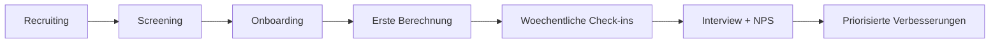

# Beta-Rekrutierung und Feedback (DACH-First)

## Ziel
In 6-9 Monaten ein belastbares, nutzbares MVP fuer einen Longevity Digital Twin aufbauen, zuerst in DE, dann DACH, dann EU.

## Zielgruppen fuer Beta
- Primaer: 35-55 Jahre, DE/AT/CH, health-conscious, Einkommen >60k EUR.
- Sekundaer: Biohacker, Manager, Personen mit familiaren Gesundheitsrisiken.

## Beta-Setup in 2 Cohorts
- Cohort 1: 30 Personen, 4 Wochen, Fokus Aktivierung und Verstaendnis.
- Cohort 2: 60 Personen, 4 Wochen, Fokus Retention und Zahlungsbereitschaft.
- Reserve: 20% Ersatzliste fuer Dropouts.

## Rekrutierungskanaele
- LinkedIn Founder-Post + 1:1 Outreach an Zielgruppe.
- Bestehendes Netzwerk (Aerzteschaft/Trainer/Health-Communities).
- Closed Landing Page mit Bewerbungsformular.

## Auswahlkriterien
- Passt zur Zielgruppe (Alter, Motivation, Datenbereitschaft).
- Bereitschaft fuer 2-3 Check-ins pro Woche.
- Einverstaendnis fuer anonymisierte Produktanalyse.

## Incentives
- Kostenloser Premium-Zugang fuer 3 Monate.
- Optional: 30-50 EUR Gutschein nach vollstaendiger Teilnahme.
- Early Access Badge + Mitgestaltungsvorteil.

## Nutzerreise in der Beta
1. Einladung + Screening.
2. Onboarding + erste Berechnung.
3. Woche 1: erste Tipps + erste zweite Berechnung.
4. Woche 2-3: Routinebildung (Reminder + Progress).
5. Woche 4: Abschlussfeedback + NPS + Interview.

## Feedback-System (leichtgewichtig)
- In-App Micro-Survey nach Schluesselaktionen (1-2 Fragen).
- Woechentlicher 5-Fragen-Check (Klarheit, Nutzen, Vertrauen, Aufwand, Motivation).
- 20-min Interviews mit 8-12 Personen pro Cohort.

## Priorisierung von Feedback
Verwende ICE-Score je Thema:
- Impact (1-10)
- Confidence (1-10)
- Ease (1-10)
- Score = (Impact * Confidence * Ease) / 100

## Interview-Leitfaden (Kurzversion)
- Was hat dir in den ersten 5 Minuten gefehlt?
- Welcher Screen war unklar?
- Was hat dir echten Mehrwert gegeben?
- Bei welchem Schritt haettest du fast abgebrochen?
- Was muesste passieren, damit du dafuer monatlich zahlst?

## Beispiel-Einladungstext
Betreff: Werde Beta-Tester fuer VitalTwin (Longevity Digital Twin)

Hallo [Name],
wir bauen eine neue Health-Plattform, die biomarkerbasiert dein biologisches Alter und konkrete Szenarien berechnet.
Wir starten eine kleine DACH-Beta mit ausgewaehlten Teilnehmern und suchen genau 30 Personen.
Dauer: 4 Wochen, Aufwand ca. 10-15 Min pro Woche.
Als Dankeschoen bekommst du Premium-Zugang und direkten Einfluss auf das Produkt.
Wenn du teilnehmen willst, antworte mit "Beta".

## Ablaufdiagramm

