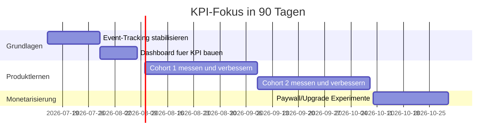

# KPI-Tracking fuer die ersten 90 Tage

## North Star
Nutzer mit wiederholtem Gesundheitsfortschritt:
- Mindestens 2 Berechnungen in 30 Tagen und
- Mindestens 1 umgesetzte Empfehlung.

## Kernmetriken (woche fuer woche)
- Activation Rate: Anteil neuer User mit erster Berechnung innerhalb 24h.
- TTV (Time to Value): Minuten von Registrierung bis erste Berechnung.
- Week-1 Retention: Nutzer, die in Woche 2 zurueckkommen.
- Week-4 Retention: Nutzer, die in Woche 5 zurueckkommen.
- Repeat Calculation Rate: Anteil mit 2+ Berechnungen/30 Tage.
- Recommendation Adoption: Anteil mit mindestens 1 als umgesetzt markierter Empfehlung.
- Conversion to Paid: Starter -> Premium.
- NPS nach Woche 4.

## Zielwerte (MVP-Phase)
- Activation Rate: >= 55%
- TTV: <= 8 Minuten
- Week-1 Retention: >= 35%
- Week-4 Retention: >= 20%
- 2+ Berechnungen/30 Tage: >= 40%
- Premium Conversion (aktive Nutzer): >= 8-12%

## Event-Schema (Minimum)
- user_registered
- onboarding_completed
- blood_values_uploaded
- twin_calculated
- scenario_viewed
- recommendation_marked_done
- weekly_checkin_completed
- premium_checkout_started
- premium_checkout_success

## Reporting-Cadence
- Montag: KPI-Dashboard + Abweichungen.
- Mittwoch: 30-min Product Review mit Top-3 Problemen.
- Freitag: Experimente fuer naechste Woche finalisieren.

## Experiment-Board Template
- Hypothese
- Segment
- Metrik
- Laufzeit
- Ergebnis
- Entscheidung (Rollout / Iteration / Drop)

## 90-Tage-Plan (KPI-Sicht)

## Red-Flag-Trigger
- Activation < 40% fuer 2 Wochen.
- Week-1 Retention < 25% fuer 2 Wochen.
- Premium Conversion < 5% trotz aktiver Nutzung.

Wenn ein Trigger ausloest:
1. Sofortige Ursachenanalyse innerhalb 48h.
2. 1-2 gezielte Fixes in den naechsten Sprint.
3. Nachmessung in der Folgewoche.
