# Master Roadmap 90 Tage (VitalTwin)

## Zielbild
In 90 Tagen von frueher Beta zu belastbarem Produkt-Markt-Signal in DACH:
- Aktivierung stabil ueber Zielwert
- Wiederkehrende Nutzung sichtbar
- Erste zahlende Nutzer aus aktivem Kernsegment
- Klar priorisierte Produkt- und Wachstums-Roadmap

## North Star
Nutzer mit wiederholtem Gesundheitsfortschritt:
- mindestens 2 Berechnungen in 30 Tagen
- mindestens 1 umgesetzte Empfehlung

## Zielsegment (Start)
- Primaer: 35-55, DE/AT/CH, health-conscious
- Sekundaer: Biohacker, ambitionierte Professionals, praeventionsorientierte Nutzer

## Angebotslogik
- Starter: schneller Einstieg und erster Aha-Moment
- Beta-Zugang: 30 Tage kostenlos, danach monatlich kuendbar
- Produktversprechen: Wellness- und Praeventionsfokus, kein Medizinprodukt

## 5 Arbeitsstroeme
1. Produktkern: Twin-Berechnung, Szenarien, Marker-Transparenz
2. Aktivierung: friktionsarmes Onboarding und Time-to-Value
3. Retention: Weekly Loop, Progress-Feedback, Nutzungsrhythmus
4. Monetarisierung: Upgrade-Experimente und Conversion-Funnel
5. Lernsystem: KPI-Tracking plus In-App-Feedback plus Interviews

## 90-Tage-Roadmap
### Phase 1 (Tag 1-30): Fundament
- Event-Tracking stabilisieren
- Dashboard fuer Kern-KPIs live
- Cohort 1 (30 Nutzer) starten
- Fokus: Aktivierung, Verstaendlichkeit, Time-to-Value

### Phase 2 (Tag 31-60): Produktlernen
- Cohort-Feedback in schnelle Iterationen ueberfuehren
- Weekly Check-ins und Handlungsempfehlungen schaerfen
- Cohort 2 (60 Nutzer) starten
- Fokus: Retention, Wiederholungsberechnung, wahrgenommener Nutzen

### Phase 3 (Tag 61-90): Monetarisierung und Skalierbarkeit
- Upgrade-Experimente (Platzierung, Copy, Timing)
- Barrieren vor Upgrade reduzieren
- Conversion-Signale und Zahlungsbereitschaft messen
- Fokus: Conversion-Qualitaet und planbarer Wachstumspfad

## KPI-Zielkorridore (MVP)
- Activation Rate: >= 55%
- Time to Value: <= 8 Minuten
- Week-1 Retention: >= 35%
- Week-4 Retention: >= 20%
- 2+ Berechnungen in 30 Tagen: >= 40%
- Conversion Starter -> Beta-Zugang: >= 8-12%

## Red Flags und Gegenmassnahmen
- Activation < 40% (2 Wochen): Onboarding-Friction sofort abbauen
- Week-1 Retention < 25% (2 Wochen): Weekly Loop und Nutzenkommunikation nachschaerfen
- Conversion < 5% trotz Aktivitaet: Upgrade-Moment, Offer-Frame und Vertrauen optimieren

## Operativer Wochenrhythmus
- Montag: KPI-Review und Abweichungsanalyse
- Mittwoch: Product-Review mit Top-3 Problemen
- Freitag: Experimente priorisieren und Sprint-Fokus fixieren

## Master Ablaufdiagramm

```mermaid
flowchart LR
A[Recruiting und Screening] --> B[Onboarding]
B --> C[Erste Twin-Berechnung]
C --> D[Szenarien und Empfehlungen]
D --> E[Weekly Check-in und Fortschritt]
E --> F[In-App Feedback und Interviews]
F --> G[Priorisierte Produktverbesserungen]
G --> H[Upgrade auf Beta-Zugang]
H --> I[Retention und Wiederholungsberechnungen]
I --> J[KPI-Review und naechste Experimente]
```

## Priorisierte Umsetzung (jetzt)
1. Marker-Erklaerungen direkt im Dashboard ergaenzen
2. Upgrade-Funnel mit klaren Triggern testen
3. Feedback-Auswertung woechentlich in Sprint-Entscheidungen uebernehmen
4. KPI-Dashboard als Single Source of Truth fuer Produktentscheidungen etablieren
