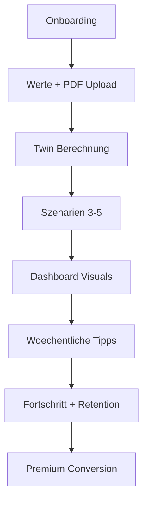

# Sprint-Backlog MVP (DACH -> EU -> Global)

## Produktpositionierung (wichtig)
- Kategorie: Wellness- und Praeventions-Produkt, kein Medizinprodukt.
- Versprechen: Verstaendliche, datenbasierte Entscheidungen fuer gesundes Altern.
- Vision: Vollstaendiger Longevity Digital Twin in Iterationen.

## Sprint 1 (2 Wochen) - Onboarding und Datenbasis
### Ziele
- Friktionsarmes Onboarding.
- Erster klarer Aha-Moment in unter 8 Minuten.

### User Stories
- Als neuer Nutzer moechte ich Alter, Geschlecht, Gewicht und Basiswerte eingeben, damit ich sofort starten kann.
- Als Nutzer moechte ich PDF-Labore hochladen, damit ich Werte nicht manuell eintippen muss.

### Tasks
- Onboarding-Flow mit Validierung und Fortschrittsanzeige.
- PDF-Upload mit einfachem Parser + manueller Korrektur.
- Event-Tracking fuer Onboarding und erste Berechnung.

### Definition of Done
- >= 90% technischer Erfolgsrate im Onboarding.
- Twin-Berechnung nach Onboarding fuer Testnutzer reproduzierbar.

## Sprint 2 (2 Wochen) - Twin Engine + Szenarien
### Ziele
- Biologisches Alter + 3-5 Szenarien als Kernnutzen.

### User Stories
- Als Nutzer moechte ich sehen, wie sich Marker auf mein biologisches Alter auswirken.
- Als Nutzer moechte ich Szenarien vergleichen, um die besten Hebel zu erkennen.

### Tasks
- Scoring transparent machen (Marker Breakdown).
- 3-5 Szenarien inkl. Annahmen und Plausibilitaet.
- Methodik-Panel mit Quellenhinweisen.

### Definition of Done
- Ergebnis + Szenarien in < 2s nach Request.
- Marker Breakdown im Dashboard sichtbar.

## Sprint 3 (2 Wochen) - Dashboard und Visuals
### Ziele
- Visuelle Klarheit, die Nutzer lieben.

### User Stories
- Als Nutzer moechte ich eine Alterungskurve sehen, damit ich den Trend verstehe.
- Als Nutzer moechte ich Intervention-Effekte sehen, damit ich motiviert bleibe.

### Tasks
- Alterungskurve (Ist vs. Ziel).
- Interventions-Impact-Chart.
- Verlaufskarten mit letzter Veraenderung.

### Definition of Done
- 3 Kerncharts responsiv auf Mobile und Desktop.
- Lighthouse PWA Performance >= 85 (mobile).

## Sprint 4 (2 Wochen) - Weekly Loop + Retention
### Ziele
- Woechentlicher Fortschrittsrhythmus.

### User Stories
- Als Nutzer moechte ich woechentliche Tipps erhalten, damit ich dranbleibe.
- Als Nutzer moechte ich Fortschritt abhaken, damit ich Erfolge sehe.

### Tasks
- Weekly Insights Card.
- Check-in Flow (Was umgesetzt?).
- Reminder-Mechanik (Email/In-App).

### Definition of Done
- 1 Weekly Loop komplett von Tip -> Umsetzung -> Tracking.
- Week-1 Retention in Beta messbar verbessert.

## Sprint 5 (2 Wochen) - Integrationen (MVP)
### Ziele
- Erste externe Datenquellen anbinden.

### Tasks
- Apple Health (erste lesende Integration).
- Google Fit (erste lesende Integration).
- Datenmapping und Qualitaetschecks.

### Definition of Done
- Mindestens 1 Datenpunkt pro Integration importierbar.
- Fail-safe Verhalten bei API-Fehlern.

## Priorisierte Nicht-Ziele (vorerst)
- Keine medizinische Diagnostik.
- Keine komplexe KI-Prognose mit klinischem Anspruch.
- Kein globaler Launch vor Produkt-Markt-Fit in DACH.

## Skalierungslogik
1. DACH: Produkt-Markt-Fit + klare Retention.
2. EU: Sprachpakete + lokale Rechts-/Datenschutzadaptionen.
3. Global: Lokale Partner, länderspezifische Datenquellen, Pricing-Lokalisierung.

## Architektur- und Produktfluss

