# VitalTwin — Twin Intelligence Architecture (TWIN_INTELLIGENCE_ARCHITECTURE.md)

> Erstellt in **Etappe 7 (Twin Intelligence Core)**. Beschreibt, wie die
> Twin Context Engine, die AI-Provider-Abstraktion und der
> Twin-Conversation-Layer zusammenspielen — die technische Architektur
> hinter "Frag deinen Twin".

## 1. Überblick

```mermaid
flowchart LR
    U["Nutzer-Nachricht"] --> A["Auth (core/auth.py)"]
    A --> B["IP-Rate-Limit (core/rate_limit.py)"]
    B --> C["Tarif-Kontingent (core/plans.py)"]
    C --> D["Prompt-Injection-Gate"]
    D --> E["Medizin-Gate"]
    E --> F["Twin Context Engine"]
    F --> G["System-Prompt-Aufbau"]
    G --> H["AIProvider.generate_twin_response()"]
    H --> I["Schema-Validierung"]
    I --> J["Output-Sicherheitsnetz"]
    J --> K["Strukturierte Antwort an Frontend"]
```



Jede Stufe kann die Anfrage sicher beenden (Fehler, Ablehnung, Limit) ohne
dass eine spätere Stufe je erreicht wird — insbesondere erreichen
Prompt-Injection- und Medizin-Anfragen **nie** den KI-Anbieter.

## 2. AI-Provider-Abstraktion (`services/ai_provider.py`)

```python
class AIProvider(ABC):
    async def generate_twin_response(...) -> TwinAIResponse: ...
    async def generate_weekly_reflection_narrative(...) -> str: ...
    async def generate_recommendation_explanation(...) -> str: ...
    async def summarize_relevant_context(...) -> str: ...
```

`routers/chat.py` hängt ausschließlich von dieser Schnittstelle ab, nie von
einem konkreten Anbieter — `OpenAIProvider` ist die einzige aktuelle
Implementierung, ein zweiter Anbieter würde nur eine neue Unterklasse
benötigen, keine Änderung an der Geschäftslogik.

### Nicht (noch) verdrahtete Fähigkeiten

- `generate_weekly_reflection_narrative`: Etappe 6 liefert den
  Wochenrückblick bereits vollständig regelbasiert
  (`services/weekly_reflection.py`). Diese Methode existiert für eine
  spätere, optionale KI-Erzählform desselben Rückblicks — bewusst noch
  nicht in die Etappe-6-UI verdrahtet, um deren dokumentierte
  Determinismus-Garantie nicht zu vermischen.
- `generate_recommendation_explanation`: Der `/why`-Endpunkt (Etappe 4)
  ist bewusst **niemals** KI-gestützt (siehe
  [TWIN_EXPLAINABILITY.md](./TWIN_EXPLAINABILITY.md)) — eine KI-generierte
  Begründung könnte Dinge behaupten, die nicht tatsächlich gespeichert
  sind. Diese Methode steht für zukünftige, klar getrennte Anwendungsfälle
  bereit (z. B. eine optionale, klar als "KI-Formulierung" gekennzeichnete
  Zusatzerklärung), ersetzt aber nie die deterministische Kernerklärung.
- `summarize_relevant_context`: wird **nicht** bei jeder Chat-Anfrage
  automatisch aufgerufen (das würde Kosten/Latenz verdoppeln). Die
  eigentliche Größenbegrenzung erfolgt deterministisch in
  `build_twin_context` (siehe [TWIN_CONTEXT.md](./TWIN_CONTEXT.md)). Diese
  Methode ist getestet und einsatzbereit für einen späteren, expliziten
  Anwendungsfall (z. B. eine Pro-Tarif-Funktion mit sehr langem
  Kontextfenster).

### Kontrollen pro Aufruf

| Kontrolle | Umsetzung |
|---|---|
| API-Schlüssel serverseitig | `os.getenv("OPENAI_API_KEY")`, nie aus dem Request |
| Timeout | `REQUEST_TIMEOUT_SECONDS = 20.0` |
| Kontrollierte Retries | `MAX_RETRIES = 1` (max. 2 Versuche gesamt), nur bei Timeout/5xx, nie bei 4xx (außer implizit durch fehlenden Retry) |
| Rate Limiting | Provider: `asyncio.Semaphore(5)` gegen parallele Kostenexplosion; Endpunkt: IP-Limit (`core/rate_limit.py`) + Tageskontingent (`core/plans.py`) |
| Maximale Eingabelänge | `MAX_INPUT_LENGTH = 500` (zusätzlich zur Pydantic-Validierung in `ChatRequest`) |
| Maximale Ausgabelänge | `MAX_OUTPUT_TOKENS = 350` (Modell) + `MAX_OUTPUT_CHARS = 2000` (harte Nachbearbeitung) |
| Kostenkontrolle | Kleines Modell (`gpt-4o-mini`), begrenzte Tokens, begrenzte Retries, begrenzte Nebenläufigkeit, tarifabhängiges Tageskontingent |
| Strukturierte Antworten | `response_format={"type":"json_object"}` + festes JSON-Schema im Systemprompt |
| Schema-Validierung | `TwinAIResponse`/`TwinAIResponseSource` (Pydantic) — ungültige Struktur wirft `AIResponseValidationError` |
| Sichere Fehlerbehandlung | Jede Fehlerklasse (`AIProviderTimeoutError`, `AIRateLimitError`, `AIProviderUnavailableError`, `AIResponseValidationError`) wird im Router auf eine ehrliche, feste Nutzermeldung abgebildet |
| Keine erfundene Antwort bei Ausfall | Bei jedem Fehler wird eine Exception geworfen, nie ein Platzhaltertext als "Antwort" ausgegeben |

## 3. Twin-Conversation-Layer (`services/twin_conversation.py`)

Enthält die Ton-Regeln (§3), das medizinische Sicherheitsnetz (§4) und die
Prompt-Injection-Erkennung (§5) — alles deterministisch, ohne KI-Aufruf.
Details: [TWIN_SAFETY.md](./TWIN_SAFETY.md).

## 4. Warum zwei Sicherheitsnetze (Eingabe + Ausgabe)?

Der Medizin-Filter läuft **zweimal**: einmal auf der Nutzer-Nachricht (bevor
überhaupt ein KI-Aufruf stattfindet — spart Kosten und verhindert, dass die
Frage das Modell überhaupt erreicht) und einmal auf der Modell-Antwort
(falls das Modell trotz Systemprompt eine medizinisch klingende Antwort
formuliert). Beide Seiten nutzen dieselbe Keyword-Liste
(`twin_conversation.py`), damit eine Umformulierung nicht auf einer Seite
durchrutscht, während sie auf der anderen erkannt würde.

## 5. Tarifstruktur (Etappe 7 §7)

Siehe [TWIN_BETA_LIMITATIONS.md](./TWIN_BETA_LIMITATIONS.md) für die
vollständige Tabelle und bekannte Einschränkungen (insbesondere: PRO/FAMILY
sind in der Datenbank aktuell nicht von PREMIUM unterscheidbar).
